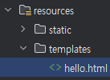
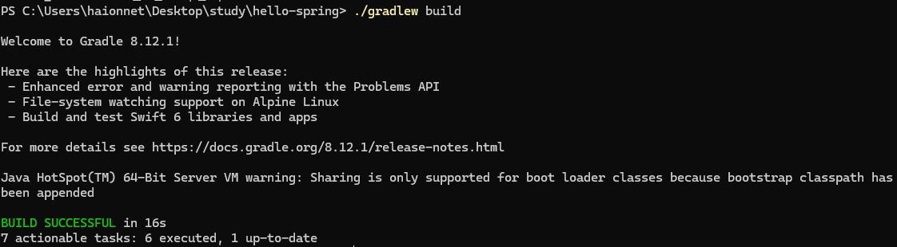

## 노트
### 1. Spring 프로젝트
* Spring initializer
    * Spring Web
    * Thymeleaf

* `build.gradle`

```gradle
plugins {
	id 'java'
	id 'org.springframework.boot' version '3.4.3'
	id 'io.spring.dependency-management' version '1.1.7'
}
```

* 설정 > 빌드 도구 > Gradle > 다음을 사용하여 빌드 및 실행 (테스트 실행도 동일) > intelliJ IDEA
    * 이를 통해 빠르게 기존보다 조금 더 빠르게 build 가능.

### 2. 라이브러리 살펴보기 
#### 스프링 부트 라이브러리
* spring-boot-starter-web
    * tomcat
    * spring mvc
* spring-boot-starter-thymeleaf
    * thymeleaf 템플릿 엔진 (View)
* spring-boot-starter: 스프링 부트 + 스프링 코어 + 로깅
    * spring-boot
        * spring-core
    * spring-boot-starter-logging
        * logback, slf4j
            * SLF4J 
                * 인터페이스
            * logback
                * 실제 로그를 어떤 구현체로 출력?
#### 테스트 라이브러리리
* JUnit Library

### 3. View 환경설정
* `src` > `main` > `resources` > `static`
    * `index.html` 생성
```html
<!DOCTYPE html>
<html lang="en">
<head>
    <meta charset="UTF-8">
    <title>Title</title>
</head>
<body>
    Hello
    <a href="/hello">hello</a>
</body>
</html>
```
* 스프링 부트가 제공하는 Welcome Page 기능
    * 기본으로 `welcome` 페이지가 뜬다.

* `HelloController`
```java
@Controller
public class HelloController {

    @GetMapping("hello")
    public String hello(Model model) {
        model.addAttribute("data", "hello!!");
        return "hello";
    }
}
```

* `src` > `main` > `resources` > `static` > `templates`
    * `hello.html`
```html
<!DOCTYPE html>
<html xmlns:th="http://www.thymeleaf.org">
<head>
    <meta charset="UTF-8">
    <title>Hello</title>
</head>
<body>
<p th:text="'안녕하세요. ' + ${data}" >안녕하세요, 손님.</p>
</body>
</html>
```
* 컨트롤러에서 리턴 값으로 문자를 반환 시, `viewResolver`가 화면을 찾아 처리
    * 스프링 부트 템플릿엔진 기본 viewName mapping
    * `resources::templates/` + {ViewName} + `.html`


### 4. 빌드하고 실행하기
* 터미널에서 파일 경로로 이동 명령어 작성
```terminal
./gradlew build
```


* `./gradlew build` > `cd build/libs` > `java-jar hello-spring-0.0.1-SNAPSHOT.jar`
* 실행확인
* `./gradlew clean` 
* `./gradlew clean build`
    * 빌드 폴더 삭제, 초기화

