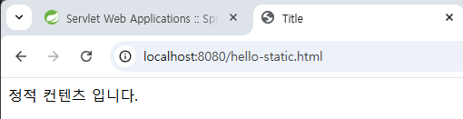
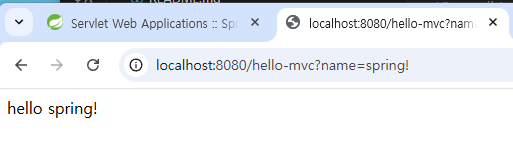

## 노트
### 1. 정적 컨텐츠
* #### 정적 컨텐츠 기능

* `src` > `resources` > `static`
    * `hello-static.html` 파일 생성
```html
<!DOCTYPE html>
<html lang="en">
<head>
    <meta charset="UTF-8">
    <title>Title</title>
</head>
<body>
정적 컨텐츠 입니다.
</body>
</html>
```
* `localhost:8080/hello-static.html` 경로 이동

* controller가 없다면, `resources` 안에 있는 정적 컨텐츠를 우선으로 보여준다.

### 2. MVC와 템플릿 엔진
* MVC: Model, View, Controller  

`HelloController`
```java
@Controller
public class HelloController {

    // ... 생략
    @GetMapping("hello-mvc")
    public String helloMvc(@RequestParam("name") String name, Model model) {
        model.addAttribute("name", name);
        return "hello-template";
    }
}
```

`src` > `main` > `resources` > `templates`
`hello-template.html`
```html
<html xmlns:th="http://www.thymeleaf.org">
<body>
<p th:text="'hello ' + ${name}">hello! empty</p>
</body>
</html>
```

`http://localhost:8080/hello-mvc?name=spring!` 경로로 이동


### 3. API

```java
@Controller
public class HelloController {
    // ... 생략
    @GetMapping("hello-string")
    @ResponseBody
    public String helloString(@RequestParam("name") String name) {
        return "hello " + name;
    }
}
```
* `http://localhost:8080/hello-string?name=spring!` 경로 이동
    * 데이터가 바로 내려온다 (소스 보기 확인!)
    * HTML 태그가 없는 상태.

```java
@Controller
public class HelloController {
    // ... 생략
    @GetMapping("hello-api")
    @ResponseBody
    public Hello helloApi(@RequestParam ("name") String name) {
        Hello hello = new Hello();
        hello.setName(name);

        return hello;
    }

    static class Hello {
        private String name;

        public String getName() {
            return name;
        }

        public void setName(String name) {
            this.name = name;
        }
    }
}
```
* `@ResponseBody`를 사용
    * HTTP의 Body에 문자 내용을 직접 반환
    * `viewResolver` 대신, `HttpMessageConverter` 동작
    * 기본 문자 처리: `StringHttpMessageConverter`
    * 기본 객체 처리: `MappingJackson2HttpMessageConverter`
    * byte 처리 등등 기타 여러 HttpMessageConverter가 기본으로 등록되어있음