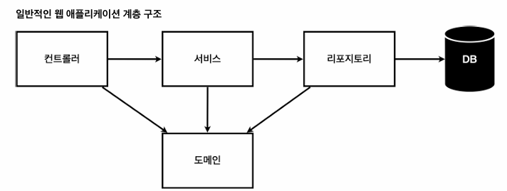

## 노트

### 1. 비즈니스 요구사항 정리
* 데이터: 회원ID, 이름
* 기능: 회원 등록, 조회
* 아직 데이터 저장소가 선정되지 않음


* 컨트롤러: 웹 MVC의 컨트롤러 역할
* 서비스: 핵심 비즈니스 로직 구현
* 리포지토리: 데이터베이스에 접근, 도메인 객체를 DB에 저장 및 관리
* 도메인: 비즈니스 도메인 객체, 예) 회원, 주문, 쿠폰 등 주로 DB에 저장되고 관리

### 2. 회원 도메인과 리포지토리 만들기

`domain` > `member`
```java
public class member {

    private Long id;
    private String name;

    public String getName() {
        return name;
    }

    public void setName(String name) {
        this.name = name;
    }

    public Long getId() {
        return id;
    }

    public void setId(Long id) {
        this.id = id;
    }
}
```
* 기본적인 setter, getter 진행

`repository` > `MemberRepository`
```java
public interface MemberRepository {
    Member save (Member member);
    Optional<Member> findById(Long id);
    Optional<Member> findByName(String name);
    List<Member> findAll();
}
```
* `interface` 작성 (구현체)

`repository` > `MemoryMemberRepository`
```java
public class MemoryMemberRepository implements MemberRepository {

    private static Map<Long, Member> store = new HashMap<>();
    private static long sequence = 0L;

    @Override
    public Member save(Member member) {
        member.setId(++sequence);
        store.put(member.getId(), member);
        return member;
    }

    @Override
    public Optional<Member> findById(Long id) {
        return Optional.ofNullable(store.get(id));
    }

    @Override
    public Optional<Member> findByName(String name) {
        return store.values().stream()
                .filter(member -> member.getName().equals(name))
                .findAny();
    }

    @Override
    public List<Member> findAll() {
        return new ArrayList<>(store.values());
    }
}

```

### 3. 회원 리포지토리 테스트 케이스 작성

* `MemoryMemberRepository`
```java
public class MemoryMemberRepository implements MemberRepository {

    private static Map<Long, Member> store = new HashMap<>();
    private static long sequence = 0L;

    // ... 생략

    public void clearStore() {
        store.clear();
    }
}
```
* 깔끔하게 지워주는 store를 만든다.

* `src` > `test` > `repository`
    * `MemoryMemberRepositoryTest`
```java
package hello.hello_spring.repository;

import hello.hello_spring.domain.Member;
import org.assertj.core.api.Assertions;
import org.junit.jupiter.api.AfterEach;
import org.junit.jupiter.api.Test;

import java.util.List;

class MemoryMemberRepositoryTest {
    MemoryMemberRepository repository = new MemoryMemberRepository();

    // 테스트 코드 작동 시 마다 데이터들을 지워준다.
    @AfterEach
    public void afterEach() {
        repository.clearStore();
    }

    @Test
    public void save() {
        Member member = new Member();
        member.setName("spring");

        repository.save(member);

        Member result = repository.findById(member.getId()).get();
        Assertions.assertThat(member).isEqualTo(result);
    }

    @Test
    public void findByName() {
        Member member1 = new Member();
        member1.setName("spring1");
        repository.save(member1);

        Member member2 = new Member();
        member2.setName("spring2");
        repository.save(member2);

        Member result = repository.findByName("spring1").get();

        Assertions.assertThat(result).isEqualTo(member1);
    }

    @Test
    public void findAll() {
        Member member1 = new Member();
        member1.setName("spring1");
        repository.save(member1);

        Member member2 = new Member();
        member2.setName("spring2");
        repository.save(member2);

        List<Member> result = repository.findAll();

        Assertions.assertThat(result.size()).isEqualTo(2);
    }
}
```
* `save()`, `findByName()`, `findAll()` 테스트 케이스 작성
* `Assertions` import 주의!

### 4. 회원 서비스 개발
* `join`
    * `validateDuplicateMember`
* `findMembers`
* `findOne`

```java
public class MemberService {
    private final MemberRepository memberRepository = new MemoryMemberRepository();

    public Long join(Member member) {

        validateDuplicateMember(member); // 중복 회원 검증
        memberRepository.save(member);
        return member.getId();
    }

    private void validateDuplicateMember(Member member) {
        memberRepository.findByName(member.getName())
                .ifPresent(m -> {
                    throw new IllegalStateException("이미 존재하는 회원입니다.");
                });
    }
    // 전체 회원 조회
    public List<Member> findMembers() {
        return memberRepository.findAll();
    }

    public Optional<Member> findOne(Long memberId) {
        return memberRepository.findById(memberId);
    }
}
```

### 5. 회원 서비스 테스트
* `src` > `test`
    * `MemberServiceTest`

* 테스트 코드를 작성할 때 추천하는 방식
    * given, when, then
```java
package hello.hello_spring.service;

import hello.hello_spring.domain.Member;
import org.assertj.core.api.Assertions;
import org.junit.jupiter.api.Test;

public class MemberServiceTest {

    MemberService memberService = new MemberService();

    @Test
    void join() {
        // given
        Member member = new Member();
        member.setName("hello");

        // when
        Long saveId = memberService.join(member);

        // then
        Member findMember = memberService.findOne(saveId).get();
        Assertions.assertThat(member.getName()).isEqualTo(findMember.getName());
    }
}
```
* 해당 사항은 너무 단순하다
    * 테스트는 예외플로우가 훨씬 더 중요 

```java
// ... 생략
public class MemberServiceTest {

    MemberService memberService = new MemberService();
    MemoryMemberRepository memberRepository = new MemoryMemberRepository();

    @AfterEach
    public void afterEach() {
        memberRepository.clearStore();
    }

    // ... 생략
    @Test
    public void duplicateExceptions() {
        // given
        Member member1 = new Member();
        member1.setName("spring");

        Member member2 = new Member();
        member2.setName("spring");

        // when
        memberService.join(member1);
        IllegalStateException e = assertThrows(IllegalStateException.class, () -> memberService.join(member2));

        // then
        Assertions.assertThat(e.getMessage()).isEqualTo("이미 존재하는 회원입니다.");
    }
}
```
* assertThrows로 중복된 예외를 체크하는 것이 중요하다.
* 하지만 여기서도 문제가 존재
    * 테스트 코드에 존재하는 `MemoryMemberRepository`가 `MemoryMemberRepository` 클래스에 있는 repository랑 다르다.
    * 현재 `MemoryMemberRepository`에서는 static을 사용하기 때문에 상관은 없지만, 나중에 DB를 사용하게 된다면 문제는 달라지게 된다. (각각 다른 인스턴스이기 때문이다.)
* 해결방법

`MemberService`
```java
// ... 생략
public class MemberService {

    private final MemberRepository memberRepository;

    public MemberService(MemberRepository memberRepository) {
        this.memberRepository = memberRepository;
    }

    public Long join(Member member) {

        validateDuplicateMember(member); // 중복 회원 검증
        memberRepository.save(member);
        return member.getId();
    }

    private void validateDuplicateMember(Member member) {
        memberRepository.findByName(member.getName())
                .ifPresent(m -> {
                    throw new IllegalStateException("이미 존재하는 회원입니다.");
                });
    }
    // 전체 회원 조회
    public List<Member> findMembers() {
        return memberRepository.findAll();
    }

    public Optional<Member> findOne(Long memberId) {
        return memberRepository.findById(memberId);
    }
}
```
* 기존의 MemberService를 생성자를 만들어준다.

`MemberServiceTest`
```java
// ... 생략
public class MemberServiceTest {

    MemberService memberService;
    MemoryMemberRepository memberRepository;

    @BeforeEach
    public void beforeEach() {
        memberRepository = new MemoryMemberRepository();
        memberService = new MemberService(memberRepository);
    }

    @AfterEach
    public void afterEach() {
        memberRepository.clearStore();
    }
    // ... 생략
    @Test
    public void duplicateExceptions() {
        // given
        Member member1 = new Member();
        member1.setName("spring");

        Member member2 = new Member();
        member2.setName("spring");

        // when
        memberService.join(member1);
        IllegalStateException e = assertThrows(IllegalStateException.class, () -> memberService.join(member2));

        // then
        Assertions.assertThat(e.getMessage()).isEqualTo("이미 존재하는 회원입니다.");
    }
}
```
* 테스트 코드에서는 `MemberService`, `MemoryMemberRepository`를 선언 후, `@BeforeEach`를 활용하여 진행
    * `@BeforeEach`는 실행하기 전에 작동
* 이로서 같은`MemoryMemberRepository`가 사용된다.
* 이를 MemberService 입장에서 Dependency Injection이라고 부른다.