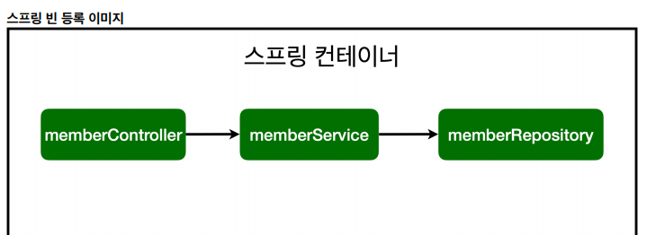

## 노트

### 1. 컴포넌트 스캔과 자동 의존관계 설정
* 회원 컨트롤러가 회원서비스와 회원 리포지토리를 사용할 수 있게 의존관계를 준비하자.

* `MemberController`, `MemberService`, `MemoryMemberRepository`
    * 각각 `@Controller`, `@Service`, `@Repository`로 Annotation -> 이를 통해 Spring으로 의존관계를 설정할 수 있다.
    * 또한 `Controller`, `Service`의 생성자에 `@Autowired`를 이용해 의존성을 주입 주입하여

#### Spring Bean을 등록하는 2가지 방법
* Component Scan과 자동 의존관계 설정
* 자바 코드로 직접 스프링 빈 등록하기

#### 이해하기!
* Annotation이 있으면, 스프링 객체를 하나씩 생성을 해서 스프링 컨테이너에 등록한다
* Autowired는 스프링 객체의 연관관계를 연결해준다.

#### 컴포넌트 스캔과 자동 의존관계 설정
* `@Component` Annotation이 있으면 Spring Bean으로 자동 등록
    * `@Component`를 포함하는 다음 Annotation도 스프링 빈으로 자동 등록된다
        * `@Controller`, `@Service`, `@Repository`
* `@Controller` 컨트롤러가 스프링 빈으로 자동 등록된 이유도 컴포넌트 스캔 때문!



#### 참고사항
* 스프링은 스프링 컨테이너에 스프링 빈을 등록할 때, 기본으로 싱글톤으로 등록
* 유일하게 하나만 등록해서 공유한다.

### 2. 자바 코드로 직접 스프링 빈 등록하기
* 기존 `MemberController`, `MemberService`, `MemoryMemberRepository`에 등록했던 Annotation을 다 지운다
* `SpringConfig` 클래스를 만든다
```java
@Configuration
public class SpringConfig {

    @Bean
    public MemberService memberService() {
        return new MemberService(memberRepository());
    }

    @Bean
    public MemberRepository memberRepository() {
        return new MemoryMemberRepository();
    }
}
```
* 이렇게 직접 `@Bean`으로 Spring 객체를 컨테이너에 등록할 수 있다.
    * 생성자가 하나면 자동으로 Autowired가 된다.

* DI에는 필드 주입, Setter 주입, 생성자 주입 3가지가 있다
    * 그냥 생성자 주입을 쓰자..

* 이후에 MemoryMemberRepository를 다른 Repository로 바꿀거이기 때문에 `@SpringConfig`로 따로 등록해놓은 것
    * 그냥 참고만 하자 DB가 정해지면 그땐 거기에 Annotation을 달면된다.