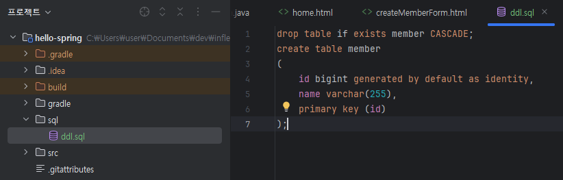

## 노트

### 1. H2 데이터베이스 설치

* 순수 JDBC
* 스프링 JdbcTemplate
* JPA
* 스프링 데이터 JPA

#### 데이터베이스 설치
* [H2 Database Console page](https://www.h2database.com/html/main.html)
    * All platform 으로 다운, 압축 풀기
* terminal에서 bin으로 경로 이동 > h2.bat 커맨드 실행
* URL: `jdbc:h2:tcp://localhost/~/test`

```sql
drop table if exists member CASCADE;
create table member
( 
    id bigint generated by default as identity,
    name varchar(255),
    primary key (id)
);
```
* member table 생성

```sql
insert into member(name) values('spring')
```
* 데이터 생성

* src 바깥 쪽 경로에 `sql` > `ddl.sql` 생성, table 생성 관리에 매우 유용하다
