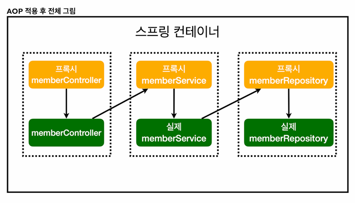

## 노트

### 1. AOP가 필요한 상황
* 모든 메소드의 호출 시간을 측정하고 싶다면?
    * 회원 가입 시간, 회원 조회 시간을 측정하고 싶다면?
* 공통 관심 사항 vs. 핵심 관심 사항

`MemberService`
```java
@Transactional
public class MemberService {

    private final MemberRepository memberRepository;

    // 의존관계 주입
    public MemberService(MemberRepository memberRepository) {
        this.memberRepository = memberRepository;
    }

    public Long join(Member member) throws SQLException {

        long start = System.currentTimeMillis();

        try {
            validateDuplicateMember(member); // 중복 회원 검증
            memberRepository.save(member);
            return member.getId();
        } finally {
            long finish = System.currentTimeMillis();
            long timeMs = finish - start;
            System.out.println("join = " + timeMs + "ms");
        }
    }

    private void validateDuplicateMember(Member member) {
        memberRepository.findByName(member.getName())
                .ifPresent(m -> {
                    throw new IllegalStateException("이미 존재하는 회원입니다.");
                });
    }
    // 전체 회원 조회
    public List<Member> findMembers() {
        return memberRepository.findAll();
    }

    public Optional<Member> findOne(Long memberId) {
        return memberRepository.findById(memberId);
    }
}
```
* `currentTimeMillis()`로 시간을 측정

### 2. AOP 적용
* AOP : Aspect Oriented Programming
* 공통 관심 사항 vs. 핵심 관심 사항 분리

`aop` > `TimeTraceAop`
```java
@Aspect
@Component
public class TimeTraceAop {

    @Around("execution(* hello.hello_spring..*(..))")
    public Object execute(ProceedingJoinPoint joinPoint) throws Throwable {
        long start = System.currentTimeMillis();
        System.out.println("Start: " + joinPoint.toString());
        try {
            return joinPoint.proceed();
        } finally {
            long finish = System.currentTimeMillis();
            long timeMs = finish-start;
            System.out.println("End : " + joinPoint.toString() + " " + timeMs + "ms");
        }

    }
}
```
* 패키지 내부에 있는 로직들의 시간을 측정
    * `@Around`를 통해 패키지 안의 특정 부분만 지정하여 시간을 측정할 수도 있다.

#### 동작 방식
* AOP 적용 후엔 가짜 서비스를 만들어 낸다. (Proxy)
* 이후 가짜 서비스를 거치고 진짜 서비스로 이동
