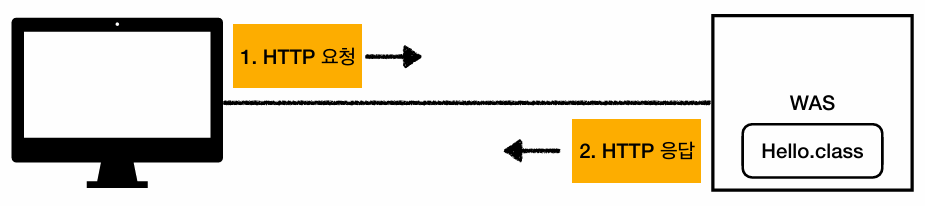
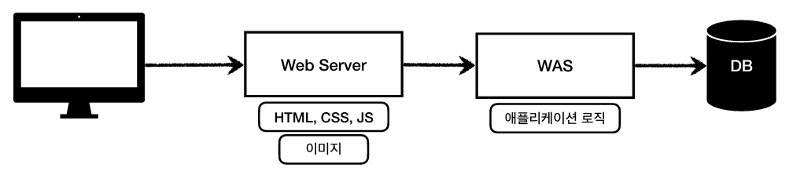
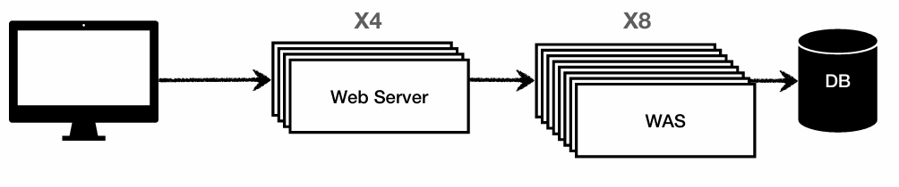
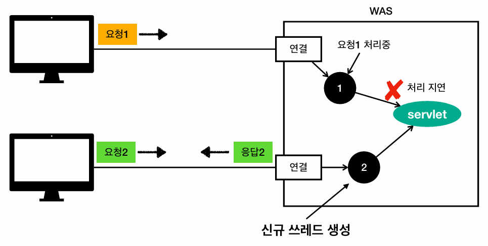
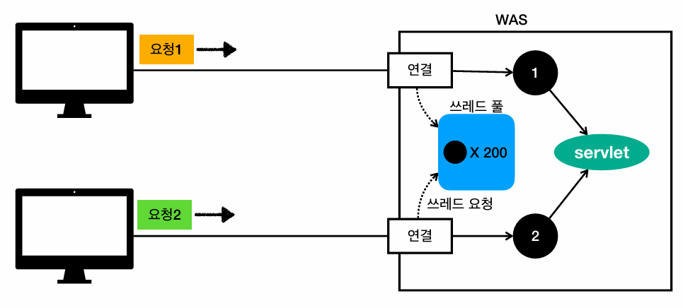

## 노트

### 1. 웹 서버, 웹 애플리케이션 서버
* Web은 모두 HTTP 기반으로 통신을 진행
* HTTP 메시지에 모든 것을 전송
    * HTML, TEXT
    * Image, 음성, 영상, 파일
    * JSON, XML (API)
    * 거의 모든 형태의 데이터 전송 가능
    * 서버간 데이터를 주고 받을 때도 대부분 HTTP 사용
#### Web server
* HTTP 기반으로 동작
* 정적 리소스 제공, 기타 부가기능
* 정적 HTML, CSS, JS, 이미지, 영상
* NginX, Apache

#### Web Application Server
* HTTP 기반으로 동작
* 웹 서버 기능 포함 + (정적 리소스 제공 가능)
* 프로그램 코드 실행 -> application 로직 수행
    * 동적 HTML, HTTP API(JSON)
    * Servlet, JSP, Spring MVC
* Tomcat, Jetty, Undertow

#### Web server vs. Web application server
* 웹 서버 > 정적 리소스, WAS > application 로직
* 자바는 서블릿 컨테이너 기능을 제공하는 WAS
    * 서블릿 없이 자바코드를 실행하는 서버 프레임워크도 존재
* WAS는 애플리케이션 코드를 실행하는 데 특화

#### Web System 구성
* WAS, DB 만으로 시스템 구성 가능
* WAS는 정적 리소스, 애플리케이션 로직 모두 제공 가능.
    * 하지만, WAS 서버 과부하 우려
    * 정적 리소스 때문에 로직 수행이 어려울 수 있음
    * WAS 장애시 오류 화면도 노출 불가!
* 정적 리소스는 Web 서버가 처리
    * 웹 서버는 로직 같은 동적인 처리가 필요할 시, WAS에 요청
    * WAS는 중요한 로직 처리 전담

* 효율적인 리소스 관리

### 2. 서블릿
* HTTP 요청 시
    * WAS는 Request, Response 객체를 새로 만들어서 서블릿 객체 호출
    * 개발자 > Request 객체에서 HTTP 요청 정보를 편리하게 꺼내서 사용
    * 개발자 > Response 객체에 HTTP 응답 정보를 편리하게 입력
    * WAS는 Response 객체에 담겨있는 내용으로 HTTP 응답 정보 생성
#### 서블릿 컨테이너
* 톰캣처럼 서블릿을 지원하는 WAS를 서블릿 컨테이너로 칭함
* 서블릿 객체를 생성, 초기화, 호출, 종료하는 생명주기 관리
* 서블릿 객체는 싱글톤으로 관리
    * 최초 로딩 시점에 서블릿 객체를 미리 만들어두고 재활용
    * 모든 고객 요청은 동일한 서블릿 객체 인스턴스에 접근
    * 공유 변수 사용 주의
* JSP도 서블릿으로 변환되어 사용
* <strong>동시 요청을 위한 멀티 쓰레드 처리 지원</strong>

### 3. 동시요청 - 멀티 쓰레드
#### 쓰레드
* **서블릿 객체를 쓰레드가 호출을 해준다** 
* 애플리케이션 코드를 하나하나 순차적으로 실행하는 것은 쓰레드
* 자바의 메인 메서드를 처음 실행하면, main이라는 이름의 쓰레드가 실행
* 쓰레드가 없다면 자바 애플리케이션 실행 불가능

#### 요청 마다 쓰레드 생성
* 장점 
    * 동시요청 처리 가능
    * 리소스가 허용할 때 까지 처리 가능
    * 하나의 쓰레드가 지연 되어도, 나머지 쓰레드는 정상 동작
* 단점
    * 쓰레드의 생성 비용은 매우 비싸다.
        * 고객의 요청이 올 때 마다 쓰레드를 생성하면, 응답속도가 늦어진다.
    * 쓰레드는 컨텍스트 스위칭 비용 발생
    * 쓰레드 생성에 제한이 없다
        * CPU, 메모리 임계점을 넘을 수 있다.

#### 쓰레드 풀
* 특징
    * 필요한 쓰레드를 쓰레드 풀에 보관 및 관리
    * 쓰레드 풀에 생성 가능한 쓰레드의 최대치 관리, 톰캣은 최대 200개 기본 설정 (변경 가능)
* 사용
    * 쓰레드가 필요하면, 이미 생성되어 있는 쓰레드를 쓰레드 풀에서 꺼내 사용
    * 사용 종료 시, 쓰레드 풀에 해당 쓰레드 반납
    * 최대 쓰레드가 모두 사용 중이어서 풀에 쓰레드가 없을 시
        * 기다리는 요청은 거절하거나, 특정 숫자 만큼만 대기하도록 설정
* 장점
    * 쓰레드가 미리 생성되어 있으므로, 쓰레드를 생성하고 종료하는 비용이 절약, 응답 시간 빠름
    * 생성 가능한 쓰레드의 최대치가 있으므로 너무 많은 요청이 들어와도 기존 요청은 안전하게 처리

* **WAS의 주요 튜닝 포인트는 최대 쓰레드 수이다.**
* 적정 숫자
    * 로직의 복잡도, CPU, 메모리, IO 리소스 상황에 따라 모두 다름
    * 성능 테스트
        * 최대한 실제 서비스와 유사하게 성능 테스트 시도
        * 툴 -> 아파치 ab, 제이미터, nGrinder

#### WAS의 멀티 쓰레드 지원
* 멀티 쓰레드의 대한 부분은 WAS가 처리
* 멀티 쓰레드 환경이므로 싱글톤 객체는 (Servlet, Spring Bean) 주의해서 사용

### 4. HTML, HTTP API, CSR, SSR
#### Static Resource
* 고정된 HTML 파일, CSS, JS, 이미지, 영상 등 제공
* 주로 Web Browser

#### HTML Page
* 동적으로 필요한 HTML 파일 생성 및 전달
* 웹 브라우저: HTML 해석

#### HTTP API
* HTML이 아니라 데이터를 전달
* 주로 JSON 형태로 데이터 통신
* UI 클라이언트
    * 앱 클라이언트
    * 웹 브라우저에서 자바스크립트를 통한 HTTP API 호출
    * React, Vue.js 같은 웹 클라이언트
* Server to Server
    * 주문 서버 -> 결제 서버
    * 기업간 데이터 통신

#### SSR (Server Side Rendering)
* 서버에서 최종 HTML을 생성해서 클라이언트에 전달
* 주로 정적인 화면에 사용
* JSP, Thymeleaf -> Backend

#### CSR (Client Side Rendering)
* HTML 결과를 자바스크립트를 사용해 웹 브라우저에서 동적으로 생성해서 적용
* 동적인 화면에 사용
* React, Vue.js -> Frontend

* 백엔드
    * JSP, 타임리프
    * 화면이 정적이고, 복잡하지 않을 때 사용
    * 백엔드 개발자는 서버 사이드 렌더링 기술 학습 필수
* 웹 프론트엔드
    * React, Vue.js
    * 복잡하고 동적인 UI 사용
    * 웹 프론트엔드 개발자의 전문 분야
* 백엔드 개발자는 서버, DB, 인프라 등등 수 많은 백엔드 기술을 공부해야함

### 5. 자바 웹 기술 역사
* 서블릿
    * HTML 생성이 어려움
* JSP
    * HTML 생성은 편리, 비즈니스 로직까지 많은 역할 담당
* 서블릿, JSP 조합 MVC 패턴 사용
    * Model, View, Controller로 역할을 나눠 개발
* MVC 프레임워크
    * MVC 패턴 자동화
    * 스트럿츠, 웹워크, 스프링 MVC
* **애노테이션 기반의 스프링 MVC 등장**
    * @Controller
* 스프링 부트
    * 서버를 내장
    * 과거엔 서버에 WAS를 직접 설치 후, 소스는 War 파일을 만들어서 설치한 WAS에 배포
    * 빌드 결과에 WAS 서버 포함 -> 빌드 배포 단순화
* Web Servlet > Spring MVC
* Web Reactive > Spring WebFlux

#### View Templates
* JSP
    * 속도 느림, 기능 부족
* 프리마커, 벨로시티
    * 속도 문제 해결, 다양한 기능
* 타임리프
    * 내추럴 템플릿: HTML의 모양 유지하면서 뷰 템플릿 적용 가능
    * Spring MVC와 강력한 기능 통합
    * 최선의 선택, 단 성능은 프리마커, 벨로시티가 더 빠름