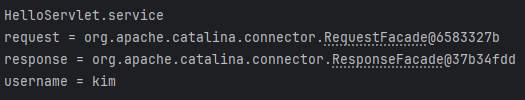
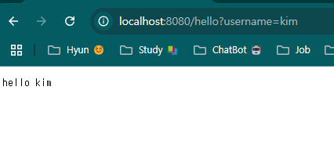
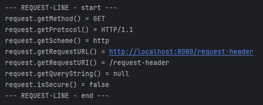
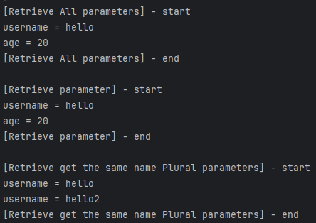
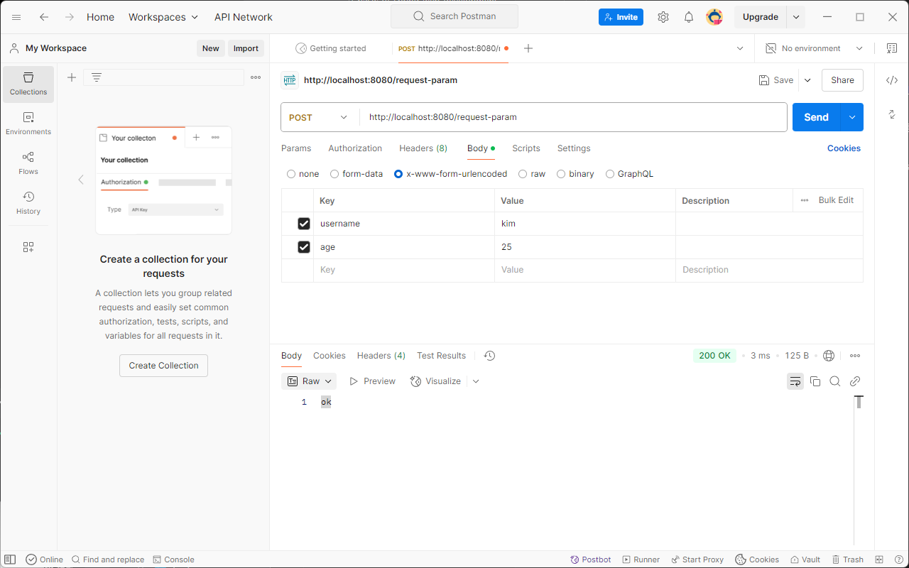
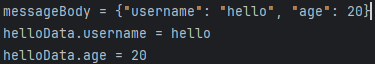

## 노트

### 1. 프로젝트 생성
* Spring initializr
    * Packaging -> War로 설정해야 JSP를 사용할 수 있다.
    * Spring Web
    * Lombok
* 설정 -> Plugin -> Marketplace -> Lombok 설치
* 설정 -> 빌드, 실행, 배포 -> 컴파일러 -> 어노테이션 프로세서 -> 어노테이션 처리 활성화 체크!
* Postman 설치

### 2. Hello 서블릿

`ServletApplication`
```java
@ServletComponentScan
@SpringBootApplication
public class ServletApplication {

	public static void main(String[] args) {
		SpringApplication.run(ServletApplication.class, args);
	}

}
```
* `ServletComponentScan`으로 서블릿을 자동 등록해준다.

`src` > `main` > `java` > `hello.servlet` > `basic`
`HelloServlet`

```java
// ... 생략
@WebServlet(name = "helloServlet", urlPatterns = "/hello")
public class HelloServlet extends HttpServlet {

    // 해당 Servlet이 호출 될 시, service 메서드가 호출이 된다.
    @Override
    protected void service(HttpServletRequest request, HttpServletResponse response) throws ServletException, IOException {
        System.out.println("HelloServlet.service");
        System.out.println("request = " + request);
        System.out.println("response = " + response);

        String username = request.getParameter("username");
        System.out.println("username = " + username);

        // Http content type 즉, header 정보
        response.setContentType("text/plain");
        response.setCharacterEncoding("utf-8");

        // Http 메세지 body에 들어감
        response.getWriter().write("hello " + username);
    }
}
```
`http://localhost:8080/hello?username=kim` 로 url 이동 (쿼리 파라미터)



`application.properties`
```
logging.level.org.apache.coyote.http11=trace
```
* logging을 찍어서 더 자세히 확인할 수 있다.
* 단, 운영 서버에 모든 요청 정보를 다 남기면 성능저하 발생 우려, 개발 단계에서만 적용하는 것이 좋다.

`src` > `main` > `webapp`
`index.html`
```html
<!DOCTYPE html>
<html>
<head>
    <meta charset="UTF-8">
    <title>Title</title>
</head>
<body>
<ul>
    <li><a href="basic.html">서블릿 basic</a></li>
</ul>
</body>
</html>
```
* `index.html`을 `webapp`폴더 안에 넣을 시, `localhost:8080` 방문 시 웰컴 페이지 기능을 제공한다.

`basic.html`
```html
<!DOCTYPE html>
<html>
<head>
    <meta charset="UTF-8">
    <title>Title</title>
</head>
<body>
<ul>
    <li>hello 서블릿
        <ul>
            <!-- Http Response 확인 > hello servlet 호출 -->
            <li><a href="/hello?username=servlet">hello 서블릿 호출</a></li>
        </ul>
    </li>
    <li>HttpServletRequest
        <ul>
            <li><a href="/request-header">기본 사용법, Header 조회</a></li>
            <li>HTTP 요청 메시지 바디 조회
                <ul>
                    <li><a href="/request-param?username=hello&age=20">GET - 쿼리 파라미터</a></li>
                    <li><a href="/basic/hello-form.html">POST - HTML Form</a></li>
                    <li>HTTP API - MessageBody -> Postman 테스트</li>
                </ul>
            </li>
        </ul>
    </li>
    <li>HttpServletResponse
        <ul>
            <li><a href="/response-header">기본 사용법, Header 조회</a></li>
            <li>HTTP 응답 메시지 바디 조회
                <ul>
                    <li><a href="/response-html">HTML 응답</a></li>
                    <li><a href="/response-json">HTTP API JSON 응답</a></li>

                </ul>
            </li>
        </ul>
    </li>
</ul>
</body>
</html>
```

### 3. HttpServletRequest - 개요
* HTTP 요청 메시지를 개발자가 직접 파싱해서 사용해도 되지만, 서블릿은 개발자가 HTTP 요청 메시지를 편리하게 사용할 수 있도록 개발자 대신에 HTTP 요청 메시지를 파싱한다.
    * 그리고 그 결과를 `HttpServletRequest` 객체에 담아 제공

#### HTTP 요청 메시지
```
<!-- START LINE -->
POST /save HTTP/1.1 
Host: localhost:8080

<!-- Header -->
Content-Type: application/x-www-form-urlencoded

<!-- Body -->
username=kim&age=20
```

* START LINE
    * HTTP 메소드
    * URL
    * 쿼리 스트링
    * 스키마, 프로토콜
* 헤더
    * 헤더 조회
* 바디
    * form 파라미터 형식 조회
    * message body 데이터 직접 조회
* 추가적으로 HttpServletRequest 객체는 부가기능이 존재
    * 임시 저장소 기능
        * 해당 HTTP 요청이 시작부터 끝날 때 까지 유지되는 임시 저장소 기능
            * 저장 : `request.setAttribute(name, value)`
            * 조회 : `request.getAttribute(name)`
    * 세션 관리 기능
        * `request.getSession(create: true)`

#### 중요
* HttpServletRequest, HttpServletResponse 를 사용할 때 가장 중요한 점은 해당 객체는 HTTP 요청 메시지, HTTP 응답 메시지를 편리하게 사용하도록 도와주는 객체라는 점, 따라서 깊은 이해를 하려면 **HTTP 스펙이 제공하는 요청, 응답 메시지 자체**를 이해 해야한다

### 4. HttpServletRequest - 기본 사용법

`basic` > `request`
`RequestHeaderServlet`
```java
// ... 생략
package hello.servlet.basic.request;

import jakarta.servlet.ServletException;
import jakarta.servlet.annotation.WebServlet;
import jakarta.servlet.http.Cookie;
import jakarta.servlet.http.HttpServlet;
import jakarta.servlet.http.HttpServletRequest;
import jakarta.servlet.http.HttpServletResponse;

import java.io.IOException;

@WebServlet(name = "requestHeaderServlet", urlPatterns = "/request-header")
public class RequestHeaderServlet extends HttpServlet {

    @Override
    protected void service(HttpServletRequest request, HttpServletResponse response) throws ServletException, IOException {

        printStartLine(request);
        printHeaders(request);
        printHeaderUtils(request);
        printEtc(request);
    }

    private static void printStartLine(HttpServletRequest request) {
        System.out.println("--- REQUEST-LINE - start ---");
        System.out.println("request.getMethod() = " + request.getMethod()); // GET
        System.out.println("request.getProtocol() = " + request.getProtocol()); // HTTP/1.1
        System.out.println("request.getScheme() = " + request.getScheme()); // http
        // http://localhost:8080/request-header
        System.out.println("request.getRequestURL() = " + request.getRequestURL());
        // /request-header
        System.out.println("request.getRequestURI() = " + request.getRequestURI());
        //username=hi
        System.out.println("request.getQueryString() = " +
                request.getQueryString());
        System.out.println("request.isSecure() = " + request.isSecure()); //https 사용 유무
        System.out.println("--- REQUEST-LINE - end ---");
        System.out.println();
    }

    //Header 모든 정보
    private void printHeaders(HttpServletRequest request) {
        System.out.println("--- Headers - start ---");

        request.getHeaderNames().asIterator()
                        .forEachRemaining(headerName -> System.out.println(headerName + " : " + headerName));

        System.out.println("--- Headers - end ---");
        System.out.println();
    }

    //Header 편리한 조회
    private void printHeaderUtils(HttpServletRequest request) {
        System.out.println("--- Header 편의 조회 start ---");
        System.out.println("[Host 편의 조회]");
        System.out.println("request.getServerName() = " +
                request.getServerName()); //Host 헤더
        System.out.println("request.getServerPort() = " +
                request.getServerPort()); //Host 헤더
        System.out.println();
        System.out.println("[Accept-Language 편의 조회]");
        request.getLocales().asIterator()
                .forEachRemaining(locale -> System.out.println("locale = " +
                        locale));
        System.out.println("request.getLocale() = " + request.getLocale());
        System.out.println();
        System.out.println("[cookie 편의 조회]");
        if (request.getCookies() != null) {
            for (Cookie cookie : request.getCookies()) {
                System.out.println(cookie.getName() + ": " + cookie.getValue());
            }
        }
        System.out.println();
        System.out.println("[Content 편의 조회]");
        System.out.println("request.getContentType() = " +
                request.getContentType());
        System.out.println("request.getContentLength() = " +
                request.getContentLength());
        System.out.println("request.getCharacterEncoding() = " +
                request.getCharacterEncoding());
        System.out.println("--- Header 편의 조회 end ---");
        System.out.println();
    }

    //기타 정보
    private void printEtc(HttpServletRequest request) {
        System.out.println("--- 기타 조회 start ---");
        System.out.println("[Remote 정보]");
        System.out.println("request.getRemoteHost() = " +
                request.getRemoteHost()); //
        System.out.println("request.getRemoteAddr() = " +
                request.getRemoteAddr()); //
        System.out.println("request.getRemotePort() = " +
                request.getRemotePort()); //
        System.out.println();
        System.out.println("[Local 정보]");
        System.out.println("request.getLocalName() = " + request.getLocalName()); //
        System.out.println("request.getLocalAddr() = " + request.getLocalAddr()); //
        System.out.println("request.getLocalPort() = " + request.getLocalPort()); //
        System.out.println("--- 기타 조회 end ---");
        System.out.println();
    }
}

```

* `printStartLine`
    * `request.getQueryString() = username=hello`
        * 쿼리 파라미터가 존재하지 않으면, null로 표기

### 5. HTTP 요청 데이터 - 개요
* HTTP 요청 메시지를 통해 클라이언트에서 서버로 데이터를 전달하는 방법을 알아보자.

* #### GET - 쿼리 파라미터
    * /url<strong>?username=hello&age=20</strong>
    * 메시지 바디 없이, URL의 쿼리 파라미터에 데이터를 포함해서 전달
    * eg. 검색, 필터, 페이징 등에서 많이 사용

* #### POST - HTML Form
    * `Content-type: application/x-www-form-encoded`
    * 메시지 바디에 쿼리 파라미터 형식으로 전달 `username=hello&age=20`
    * eg. 회원 가입, 상품 주문, HTML Form 사용

* #### HTTP message body에 데이터를 직접 담아서 요청
    * HTTP API에서 주로 사용, JSON, XML, TEXT
* 데이터 형식은 주로 JSON 사용
    * POST, PUT, PATCH

### 6. HTTP 요청 데이터 - GET 쿼리 파라미터
```java
// ... 생략
/**
 * 1. 파라미터 전송 기능
 * http://localhost:8080/request-param?username=hello&age=20
 */
@WebServlet(name = "requestParamServlet", urlPatterns = "/request-param")
public class RequestParamServlet extends HttpServlet {
    @Override
    protected void service(HttpServletRequest request, HttpServletResponse response) throws ServletException, IOException {
        System.out.println("[Retrieve All parameters] - start");
        request.getParameterNames().asIterator().forEachRemaining(paramName -> System.out.println(paramName + " = " + request.getParameter(paramName)));
        System.out.println("[Retrieve All parameters] - end");
        System.out.println();

        System.out.println("[Retrieve parameter] - start");
        String username = request.getParameter("username");
        String age = request.getParameter("age");

        System.out.println("username = " + username);
        System.out.println("age = " + age);

        System.out.println("[Retrieve parameter] - end");
        System.out.println();

        System.out.println("[Retrieve get the same name Plural parameters] - start");
        String[] usernames = request.getParameterValues("username");
        for (String name : usernames) {
            System.out.println("username = " + name);
        }
        System.out.println("[Retrieve get the same name Plural parameters] - end");

        response.getWriter().write("ok");
    }
}
```

* 파라미터 이름은 하나인데, 중복이 된다?
    * 중복일때는 맨 첫번째 값만 반환이 된다
* `getParameterValues(parameter)`를 이용하여 중복되는 파라미터 이름의 값을 반환 받을 수 있다. (2개 이상)
    * 하지만 이런 경우는 드물고, 잘 안쓰인다.
* 중복되는 일이 없도록 `getParameter(parameter)`를 써서 진행토록 하자.

### 7. HTTP 요청 데이터 - POST HTML Form
* 주로 회원 가입, 상품 주문 등에서 사용하는 방식

`src` > `main` > `webapp` > `basic`
`hello-form.html`

```html
<!DOCTYPE html>
<html>
<head>
    <meta charset="UTF-8">
    <title>Title</title>
</head>
<body>
<form action="/request-param" method="post">
    username: <input type="text" name="username" />
    age:      <input type="text" name="age" />
    <button type="submit">전송</button>
</form>
</body>
</html>
```

* `<form>` 태그를 활용하여 요청을 보낸다.
* `request.getParameter` 방식으로 파라미터의 value 값을 사용할 수 있다.
* 만약 form으로 하는게 번거롭다면, `postman`을 써보자

* 원하는 key, value 값을 지정 후, 원하는 url과 방식을 지정한 후 send를 보내면 직접 form을 작성하지 않고도 테스트가 가능하다.

### 8. HTTP 요청 데이터 - API 메시지 바디 - 단순 텍스트
* **HTTP message body**에 데이터를 직접 담아서 요청
    * HTTP API에서 주로 사용, JSON, XML, TEXT
    * 데이터 형식은 주로 JSON
    * POST, PUT, PATCH

```java
// ... 생략
@WebServlet(name = "requestBodyStringServlet", urlPatterns = "/request-body-string")
public class RequestBodyStringServlet extends HttpServlet {
    @Override
    protected void service(HttpServletRequest request, HttpServletResponse response) throws ServletException, IOException {
        ServletInputStream inputStream = request.getInputStream();
        String messageBody = StreamUtils.copyToString(inputStream, StandardCharsets.UTF_8);

        System.out.println("messageBody = " + messageBody);
        response.getWriter().write("ok");
    }
}
```
* request로 클라이언트에서 서버 측으로 요청을 보냄
* request는 요청 데이터 처리, api 요청 처리 등에서 많이 쓰임
    * eg. 회원 가입 시 서버는 request에서 값을 꺼내어 db에 저장이 가능
    * 로그인 및 인증 처리, url에서 데이터 가져오기 (쿼리 파라미터, 경로 변수 등..)

### 8. HTTP 요청 데이터 - API 메시지 바디 - JSON

`src` > `main` > `java` > `hello.servlet` > `basic`

`HelloData`
```java
package hello.servlet.basic;

import lombok.Getter;
import lombok.Setter;

@Getter @Setter
public class HelloData {
    private String username;
    private int age;
}
```
* lombok은 `@Getter`, `@Setter` 지정으로 대신할 수 있다 (게터, 세터 만들 필요 X)

`RequestBodyJsonServlet`
```java
// ... 생략
@WebServlet(name = "requestBodyJsonServlet", urlPatterns = "/request-body-json")
public class RequestBodyJsonServlet extends HttpServlet {
    @Override
    protected void service(HttpServletRequest request, HttpServletResponse response) throws ServletException, IOException {
        ServletInputStream inputStream = request.getInputStream();
        String messageBody = StreamUtils.copyToString(inputStream, StandardCharsets.UTF_8);

        System.out.println("messageBody = " + messageBody);

        HelloData helloData = objectMapper.readValue(messageBody, HelloData.class);

        System.out.println("helloData.username = " + helloData.getUsername());
        System.out.println("helloData.age = " + helloData.getAge());

        response.getWriter().write("ok");
    }
}
```
