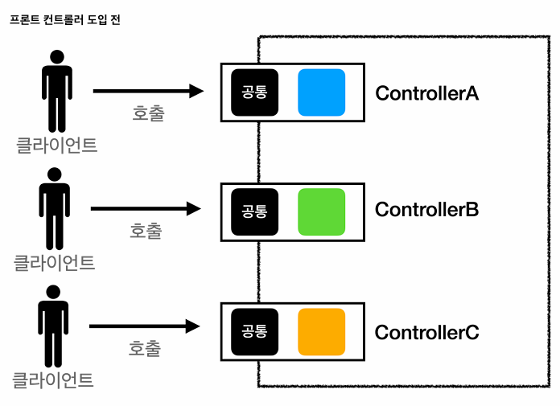
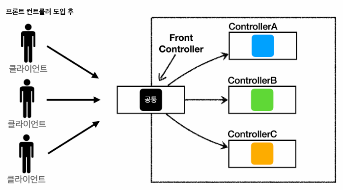

## 노트

### 1. 프론트 컨트롤러 패턴 소개

- 프론트 컨트롤러 도입 전에는 공통 로직을 각각 따로 작성해줘야하는 번거로움 존재 \* 즉, 반복되는 코드가 증가
  

- 이후, 공통 로직을 프론트 컨트롤러가 처리 후, 각각 필요한 로직은 따로 처리하는 패턴을 만듦
  

- 스프링 웹 MVC와 프론트 컨트롤러
  - 스프링 웹 MVC의 핵심도 `FrontController`
  - 스프링 웹 MVC의 `DispatcherServlet`이 FrontController 패턴으로 구현되어 있음.

### 2. 프론트 컨트롤러 도입 - v1

- `servlet` > `web` > `frontcontroller` > `v1`
  - `ControllerV1`

```java
// ... 생략
public interface ControllerV1 {
    void process(HttpServletRequest request, HttpServletResponse response) throws ServletException, IOException;
}
```

- 서블릿과 비슷한 형태의 컨트롤러 인터페이스 도입, 각 컨트롤러들은 해당 인터페이스를 구현하면 된다.
- 프론트 컨트롤러는 이 인터페이스를 호출해서 구현과 관계없이 로직의 일관성을 가져갈 수 있다.

- `servlet` > `web` > `frontcontroller` > `v1` > `controller`
  - `MemberFormControllerV1`

```java
// ... 생략
public class MemberFormControllerV1 implements ControllerV1 {
    @Override
    public void process(HttpServletRequest request, HttpServletResponse response) throws ServletException, IOException {
        String viewPath = "/WEB-INF/views/new-form.jsp";
        RequestDispatcher dispatcher = request.getRequestDispatcher(viewPath);
        dispatcher.forward(request, response);
    }
}
```

- 이전 servletmvc 했던 코드와 동일하다.

- `servlet` > `web` > `frontcontroller` > `v1` > `controller`
  - `MemberListControllerV1`

```java
// ... 생략
public class MemberListControllerV1 implements ControllerV1 {

    private MemberRepository memberRepository = MemberRepository.getInstance();

    @Override
    public void process(HttpServletRequest request, HttpServletResponse response) throws ServletException, IOException {
        List<Member> members = memberRepository.findAll();
        request.setAttribute("members", members);
        String viewPath = "/WEB-INF/views/members.jsp";
        request.getRequestDispatcher(viewPath).forward(request, response);
    }
}
```

- `servlet` > `web` > `frontcontroller` > `v1` > `controller`
  - `MemberSaveControllerV1`

```java
// ... 생략
public class MemberSaveControllerV1 implements ControllerV1 {

    private MemberRepository memberRepository = MemberRepository.getInstance();

    @Override
    public void process(HttpServletRequest request, HttpServletResponse response) throws ServletException, IOException {
        String username = request.getParameter("username");
        int age = Integer.parseInt(request.getParameter("age"));

        Member member = new Member(username, age);
        memberRepository.save(member);

        request.setAttribute("member", member);

        String viewPath = "/WEB-INF/views/save-result.jsp";
        request.getRequestDispatcher(viewPath).forward(request, response);
    }
}
```

- `servlet` > `web` > `frontcontroller` > `v1`
  - `FrontControllerServletV1`

```java
// ... 생략
@WebServlet(name = "frontControllerServletV1", urlPatterns = "/front-controller/v1/*")
public class FrontControllerServletV1 extends HttpServlet {

    private Map<String, ControllerV1> controllerMap = new HashMap<>();

    public FrontControllerServletV1() {
        controllerMap.put("/front-controller/v1/members/new-form", new MemberFormControllerV1());
        controllerMap.put("/front-controller/v1/members/save", new MemberSaveControllerV1());
        controllerMap.put("/front-controller/v1/members", new MemberListControllerV1());
    }

    @Override
    protected void service(HttpServletRequest request, HttpServletResponse response) throws ServletException, IOException {
        // uri 파라미터를 받아올 수 있다.
        String requestURI = request.getRequestURI();

        ControllerV1 controller = controllerMap.get(requestURI);

        if (controller == null) {
            response.setStatus(HttpServletResponse.SC_NOT_FOUND);
            return;
        }

        controller.process(request, response);
    }
}
```

- `urlPatterns`에서 `*`로 `/front-controller/v1`을 포함한 하위 모든 요청은 해당 서블릿에서 받아들인다.
- 해당 코드에서 `HashMap`을 사용, controller들의 uri를 반환 받아서 각 Map에 해당하는 uri가 들어오면 그 해당 되는 value인 controller가 반환되는 방식으로 진행
- 해당 `controller`의 `process`를 호출 `request`, `response` 파라미터로 받아서 진행
  - 만약 `controller`가 `null` 이라면, `404 Error`

### 3. View 분리 - v2

- 모든 컨트롤러에서 뷰로 이동하는 부분에 중복이 존재, 깔끔하지 않음.

```java
String viewPath = "/WEB-INF/views/new-form.jsp";
RequestDispatcher dispatcher = request.getRequestDispatcher(viewPath);
dispatcher.forward(request, response);
```

- 이를 해결하기 위해 별도로 뷰를 처리하는 객체를 만든다.

- `servlet` > `web` > `frontcontroller`
  - `MyView`

```java
public class MyView {
    private String viewPath;

    public MyView(String viewPath) {
        this.viewPath = viewPath;
    }

    public void render(HttpServletRequest request, HttpServletResponse response) throws ServletException, IOException {
        RequestDispatcher dispatcher = request.getRequestDispatcher(viewPath);
        dispatcher.forward(request, response);
    }
}
```

- 기존의 `viewPath`와 dispatcher로 진행했던 로직을 MyView 객체로 만듦.

* `servlet` > `web` > `frontcontroller` > `v2`
  - `ControllerV2`

```java
// ... 생략
public interface ControllerV2 {
    MyView process(HttpServletRequest request, HttpServletResponse response) throws ServletException, IOException;
}
```

- 이후 `interface`를 만들때, 기존의 `void` 타입 반환에서 `MyView` 반환으로 변경

* `servlet` > `web` > `frontcontroller` > `v2` > `controller`
  - `MemberFormControllerV2`

```java
// ... 생략
public class MemberFormControllerV2 implements ControllerV2 {

    @Override
    public MyView process(HttpServletRequest request, HttpServletResponse response) throws ServletException, IOException {
        return new MyView("/WEB-INF/views/new-form.jsp");
    }
}
```

- `servlet` > `web` > `frontcontroller` > `v2` > `controller`
  - `MemberListControllerV2`

```java
// ... 생략
public class MemberListControllerV2 implements ControllerV2 {

    private MemberRepository memberRepository = MemberRepository.getInstance();

    @Override
    public MyView process(HttpServletRequest request, HttpServletResponse response) throws ServletException, IOException {
        List<Member> members = memberRepository.findAll();
        request.setAttribute("members", members);
        return new MyView("/WEB-INF/views/members.jsp");
    }
}
```

- `servlet` > `web` > `frontcontroller` > `v2` > `controller`
  - `MemberSaveControllerV2`

```java
// ... 생략
public class MemberSaveControllerV2 implements ControllerV2 {

    private MemberRepository memberRepository = MemberRepository.getInstance();

    @Override
    public MyView process(HttpServletRequest request, HttpServletResponse response) throws ServletException, IOException {

        String username = request.getParameter("username");
        int age = Integer.parseInt(request.getParameter("age"));

        Member member = new Member(username, age);
        memberRepository.save(member);

        request.setAttribute("member", member);

        return new MyView("/WEB-INF/views/save-result.jsp");

    }
}
```

- `servlet` > `web` > `frontcontroller` > `v2`
  - `FrontControllerServletV2`

```java
// ... 생략
@WebServlet(name = "frontControllerServletV2", urlPatterns = "/front-controller/v2/*")
public class FrontControllerServletV2 extends HttpServlet {

    private Map<String, ControllerV2> controllerMap = new HashMap<>();

    public FrontControllerServletV2() {
        controllerMap.put("/front-controller/v2/members/new-form", new MemberFormControllerV2());
        controllerMap.put("/front-controller/v2/members/save", new MemberSaveControllerV2());
        controllerMap.put("/front-controller/v2/members", new MemberListControllerV2());
    }

    @Override
    protected void service(HttpServletRequest request, HttpServletResponse response) throws ServletException, IOException {
        // uri 파라미터를 받아올 수 있다.
        String requestURI = request.getRequestURI();

        ControllerV2 controller = controllerMap.get(requestURI);

        if (controller == null) {
            response.setStatus(HttpServletResponse.SC_NOT_FOUND);
            return;
        }

        // new MyView("/WEB-INF/views/new-form.jsp");
        MyView view = controller.process(request, response);
        view.render(request, response);
    }
}
```

- interface에서 return을 MyView로 통일한다 (기존에는 void)
- 각각 Controller에서 return에 새로운 MyView 객체를 반환한다 (`jsp` 경로를 파라미터로 받는다 (`viewPath`))

* 이후 `FrontControllerServletV2`에서 `MyView`로 반환된 객체 -> `view.render` 실행

### 4. Model 추가 - v3

- **서블릿 종속성 제거**

  - `request` 객체를 `Model`로 사용하는 대신, 별도의 `Model` 객체를 만들어서 반환하면 된다.
  - **우리가 구현하는 컨트롤러가 서블릿 기술을 전혀 사용하지 않도록 변경하는 것이 목적**
  - 구현 코드 단순화, 테스트 코드 작성이 쉽다.

- ## **뷰 이름 중복 제거**
  - `/WEB-INF/views/new-form.jsp` -> `new-form`
  - `/WEB-INF/views/save-result.jsp` -> `save-result`
  - `/WEB-INF/views/members.jsp` -> `members`
