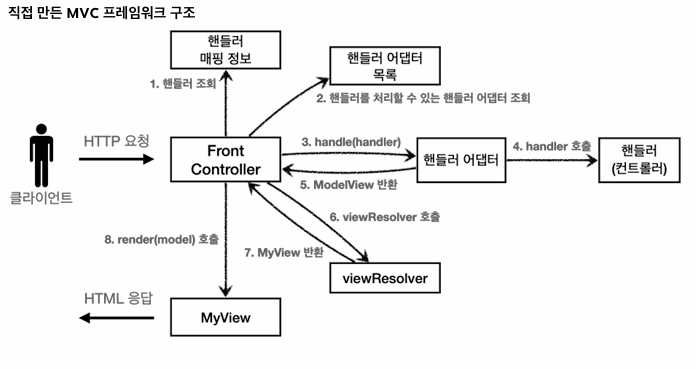
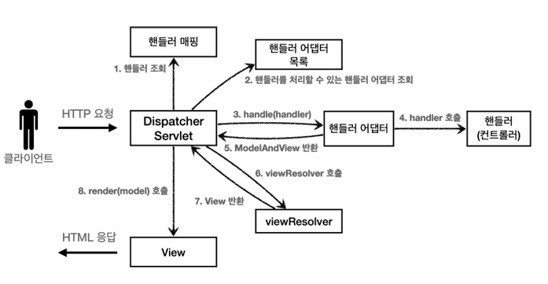

## 노트

### 1. 스프링 MVC 전체 구조

- 이전에 만든 MVC framework와 유사한 구조를 가지고 있다.
- 이전
  - 
- 이후
  - 

* **FrontController -> DispatcherServlet**
* handlerMappingMap -> HandlerMapping
* MyHandlerAdapter -> HandlerAdapter
* ModelView -> ModelAndView
* viewResolver -> ViewResolver
* MyView -> View-Resolver

#### `DispatcherServlet` 서블릿 등록

- `DispatcherServlet`도 부모클래스에서 `HttpServlet`을 상속받아서 사용, 서블릿으로 동작
  - `DispatcherServlet` -> `FrameworkServlet` -> `HttpServletBean` -> `HttpServlet`
- Spring Boot는 `DispatcherServlet`을 서블릿으로 자동으로 등록하면서 모든 경로에 대해서 매핑
  - 더 자세한 경로가 높은 우선순위를 가진다. 그래서 기존에 등록한 서블릿도 함께 동작한다.
- 핵심 동작방식을 알아두어야 문제 발생 시 어떤 부분에서 문제를 발생했는지 쉽게 파악하고 해결할 수 있다.
  - 확장 포인트 캐칭 가능

### 2. 핸들러 매핑과 핸들러 어댑터

- 핸들러 매핑과 핸들러 어댑터가 어떤 것들이 어떻게 사용되는지 알아보자
- 지금은 전혀 사용하지 않지만, 과거에 주로 사용했던 스프링이 제공하는 간단한 컨트롤러로 핸들러 매핑과 어댑터를 이해하기

* `servlet` > `web` > `springmvc` > `old`
  - `OldController`

```java
// ... 생략
@Component("/springmvc/old-controller")
public class OldController implements Controller {

    @Override
    public ModelAndView handleRequest(HttpServletRequest request, HttpServletResponse response) throws Exception {
        System.out.println("OldController.handleRequest");
        return null;
    }
}
```

- `HandlerMapping`
  - 핸들러 매핑에서 해당 컨트롤러를 찾을 수 있어야 한다.
  - e.g. `스프링 빈의 이름으로 핸들러를 찾을 수 있는 핸들러 매핑`이 필요
- `HandlerAdapter`
  - 핸들러 매핑을 통해서 찾은 핸들러를 실행할 수 있는 핸들러 어댑터 필요
  - e.g. `Controller` 인터페이스를 실행할 수 있는 핸들러 어댑터를 찾고 실행

```java
// ... 생략
@Component("/springmvc/request-handler")
public class MyHttpRequestHandler implements HttpRequestHandler {
    @Override
    public void handleRequest(HttpServletRequest request, HttpServletResponse response) throws ServletException, IOException {
        System.out.println( "MyHttpRequestHandler.handleRequest");
    }
}
```

1. 핸들러 매핑으로 핸들러 조회
2. 핸들러 어댑터 조회
3. 핸들러 어댑터 실행

### 3. 뷰 리졸버

```java
// ... 생략
@Component("/springmvc/old-controller")
public class OldController implements Controller {

    @Override
    public ModelAndView handleRequest(HttpServletRequest request, HttpServletResponse response) throws Exception {
        System.out.println("OldController.handleRequest");
        return new ModelAndView("new-form");
    }
}
```

- 이전에 만들었던 `OldController`를 살짝 수정했다 (`ModelAndView` 추가)

`application.properties`

```
spring.mvc.view.prefix=/WEB-INF/views/
spring.mvc.view.suffix=.jsp
```

- 해당 부분을 추가하면 `http://localhost:8080/springmvc/old-controller`url 로 이동 시, View가 뜬다.

1. 핸들러 어댑터 호출
2. ViewResolver 호출
3. InternalResourceViewResolver
4. 뷰 - InternalResourceView
5. view.render()

### 4. 스프링 MVC 시작하기

- 스프링이 제공하는 컨트롤러는 Annotation 기반으로 동작, 매우 유연하고 실용적

- `@RequestMapping`
  - `RequestMappingHandlerMapping`
  - `RequestMappingHandlerAdapter`

* `servlet` > `web` > `springmvc` > `v1`
  - `SpringMemberFormControllerV1`

```java
// ... 생략
@Controller
public class SpringMemberFormControllerV1 {

    @RequestMapping("/springmvc/v1/members/new-form")
    public ModelAndView process() {
        return new ModelAndView("new-form");
    }
}
```

- 이전에 `application.properties`에서 진행했었던 prefix, suffix로 인해 `localhost:8080/springmvc/v1/members/new-form` 으로 이동하면 회원가입 창이 뜬다.
- `@Controller`
  - 스프링이 자동으로 스프링 빈으로 등록
  - 스프링 MVC에서 Annotation 기반 컨트롤러로 인식
- `@RequestMapping`
  - 요청 정보 매핑 (해당 URL이 호출되면 해당 메서드가 호출)
  - Annotation을 기반으로 동작하기 때문에, 메서드의 이름은 임의 지정
- `ModelAndView`
  - 모델과 View 정보를 담아서 반환

* `servlet` > `web` > `springmvc` > `v1`
  - `SpringMemberSaveControllerV1`

```java
// ... 생략
@Controller
public class SpringMemberSaveControllerV1 {

    private MemberRepository memberRepository = MemberRepository.getInstance();

    @RequestMapping("springmvc/v1/members/save")
    public ModelAndView process(HttpServletRequest request) {
        String username = request.getParameter("username");
        int age = Integer.parseInt(request.getParameter("age"));

        Member member = new Member(username, age);
        memberRepository.save(member);

        ModelAndView mv = new ModelAndView("save-result");
        mv.addObject("member", member);

        return mv;
    }
}
```

- `servlet` > `web` > `springmvc` > `v1`
  - `SpringMemeberListControllerV1`

```java
// ... 생략
@Controller
public class SpringMemeberListControllerV1 {
    private MemberRepository memberRepository = MemberRepository.getInstance();

    @RequestMapping( "/springmvc/v1/members")
    public ModelAndView process() {
        List<Member> members = memberRepository.findAll();
        ModelAndView mv = new ModelAndView("members");
        mv.addObject("members", members);
        return mv;
    }
}
```

### 5. 스프링 MVC - 컨트롤러 통합

```java
// ... 생략
@Controller
@RequestMapping("/springmvc/v2/members")
public class SpringMemberControllerV2 {

    private MemberRepository memberRepository = MemberRepository.getInstance();

    @RequestMapping("/new-form")
    public ModelAndView newForm() {
        return new ModelAndView("new-form");
    }

    @RequestMapping("/save")
    public ModelAndView save(HttpServletRequest request) {
        String username = request.getParameter("username");
        int age = Integer.parseInt(request.getParameter("age"));

        Member member = new Member(username, age);
        memberRepository.save(member);

        ModelAndView mv = new ModelAndView("save-result");
        mv.addObject("member", member);

        return mv;
    }
    // /springmvc/v2/members
    @RequestMapping
    public ModelAndView members() {
        List<Member> members = memberRepository.findAll();
        ModelAndView mv = new ModelAndView("members");
        mv.addObject("members", members);
        return mv;
    }
}
```

- 분리되어있던 `@Controller`를 하나로 통합할 수 있다.
- 클래스 레벨에서 `RequestMapping을` 할 수 있다.
  - 이후 메서드 레벨에서 url을 이어 붙일 수 있다
    - 만약 메서드 레벨에 `@RequestMapping` url이 없다면, 클래스 레벨의 url을 따라간다.

### 6. 스프링 MVC - 실용적인 방식

- `servlet` > `web` > `springmvc` > `v3`
  - `SpringMemeberListControllerV3`

```java
// ... 생략
@Controller
@RequestMapping("/springmvc/v3/members")
public class SpringMemberControllerV3 {

    private MemberRepository memberRepository = MemberRepository.getInstance();

    @RequestMapping(value = "/new-form", method = RequestMethod.GET)
    public String newForm() {
        return "new-form";
    }

    @RequestMapping(value = "/save", method = RequestMethod.POST)
    public String save(
            @RequestParam("username") String username,
            @RequestParam("age") int age,
            Model model) {

        Member member = new Member(username, age);
        memberRepository.save(member);

        model.addAttribute("member", member);

        return "save-result";
    }

    @RequestMapping(method = RequestMethod.GET)
    public String members(Model model) {
        List<Member> members = memberRepository.findAll();
        model.addAttribute("members", members);
        return "members";
    }
}
```

- 보기 쉽게 바뀌었다
- `@RequestMapping(value, method)`

  - method는 `GET`, `POST` 등 요청의 제약을 건다
  - `GET`을 지정해놓고 `POST` 나 다른 요청이 들어오면 405 Error 반환

- `servlet` > `web` > `springmvc` > `v3`
  - `SpringMemeberListControllerV3`

```java
@Controller
@RequestMapping("/springmvc/v3/members")
public class SpringMemberControllerV3 {

    private MemberRepository memberRepository = MemberRepository.getInstance();

    @GetMapping(value = "/new-form")
    public String newForm() {
        return "new-form";
    }

    @PostMapping(value = "/save")
    public String save(
            @RequestParam("username") String username,
            @RequestParam("age") int age,
            Model model) {

        Member member = new Member(username, age);
        memberRepository.save(member);

        model.addAttribute("member", member);

        return "save-result";
    }

    @GetMapping
    public String members(Model model) {
        List<Member> members = memberRepository.findAll();
        model.addAttribute("members", members);
        return "members";
    }
}
```

- `@RequestMapping`을 더 간단히 바꾸었다
  - `@GetMapping`, `@PostMapping` 등으로 리팩토링 진행
